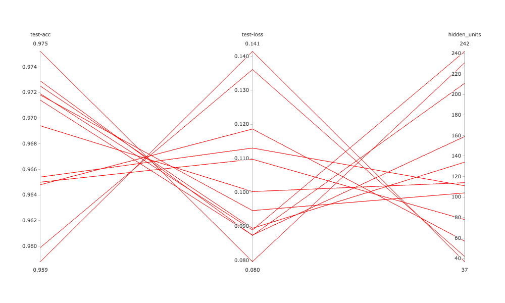

# Katib Tutorial

Hyper Parameter Tuning을 위한 Katib 사용법입니다.

### Reference

- https://www.kubeflow.org/docs/components/katib/
- [지구별 여행자 Katib](https://kangwoo.kr/2020/03/21/kubeflow-katib-%ED%95%98%EC%9D%B4%ED%8D%BC-%ED%8C%8C%EB%9D%BC%EB%AF%B8%ED%84%B0-%ED%8A%9C%EB%8B%9D/)


### Katib Install

Release version을 다운받았습니다. https://github.com/kubeflow/katib 참고

```bash
kubectl apply -k "github.com/kubeflow/katib.git/manifests/v1beta1/installs/katib-standalone?ref=v0.11.1"
```


### QuickStart

Clone this repo and:

```bash
kubectl apply -f simple-katib.yaml
```


| Input        | Range                 | algorithm |
| ------------ | --------------------- | --------- |
| hidden_units | Min: 32<br />Max: 256 | random    |


### Result



| trialName             | Status    | test-acc | test-loss | hidden_inits |
| --------------------- | --------- | -------- | --------- | ------------ |
| simple-mnist-4pk427lc | Succeeded | 0.9725   | 0.0894    | 134          |
| simple-mnist-5x8d5v2q | Succeeded | 0.9648   | 0.1186    | 57           |
| simple-mnist-88xqdfmx | Succeeded | 0.9599   | 0.1361    | 42           |
| simple-mnist-blht5vkn | Succeeded | 0.9718   | 0.0946    | 104          |
| simple-mnist-d57r7td2 | Succeeded | 0.9752   | 0.0796    | 231          |
| simple-mnist-jrfrtd59 | Succeeded | 0.9650   | 0.1097    | 78           |
| simple-mnist-lr4xdp2v | Succeeded | 0.9588   | 0.1414    | 37           |
| simple-mnist-p22rt4gk | Succeeded | 0.9654   | 0.1130    | 111          |
| simple-mnist-r2tzk76v | Succeeded | 0.9729   | 0.0873    | 211          |
| simple-mnist-rmh9srgh | Succeeded | 0.9714   | 0.0874    | 159          |
| simple-mnist-sxntzsx7 | Succeeded | 0.9719   | 0.0889    | 242          |
| simple-mnist-wl66wqnv | Succeeded | 0.9694   | 0.1002    | 114          |


### How it works

`simple-katib.yaml` 에 메트릭 수집에 대한 언급없이 test-acc, test-loss 값이 수집되는 것은 Katib Metrics Collection의 default가 StdOut이기 때문입니다. `print` 를 통해 출력되는 값들을 자동으로 수집하여 결과로 보여줍니다. `train.py` 를 보면 `print(f"model test-loss={loss:.4f} test-acc={acc:.4f}")` 다음과 같이 수집이 가능하도록 출력형태를 맞춘것을 확인할 수 있습니다.


### Manual

**1. make your docker image**

```bash
# docker build
docker build -t <YOUR_CONTAINER_REGISTRY>/<IMAGE_NAME>:<TAG> .
# ex) docker build -t ssuwani/katib-mnist:v0.1 .

# docker push
docker push <YOUR_CONTAINER_REGISTRY>/<IMAGE_NAME>:<TAG>
# ex) dockerp push ssuwani/katib-mnist:v0.1
```

**2. try with simple-job.yaml (Option)**

edit `.spec.template.spec.containers[0].image`

```bash
# ex)
# <YOUR_CONTAINER_REGISTRY>/<IMAGE_NAME>:<TAG> 
# to
# ssuwani/katib-mnist:v0.1
```

run `simple-job.yaml`:

```bash
kubectl apply -f simple-job.yaml
```

check your training with pods: `kubectl get pods`

logs training pod:

```bash
kubectl logs simple-job-hwpps

Downloading data from https://storage.googleapis.com/tensorflow/tf-keras-datasets/mnist.npz
11493376/11490434 [==============================] - 0s 0us/step
11501568/11490434 [==============================] - 0s 0us/step
2021-11-24 02:38:47.685391: I tensorflow/core/platform/cpu_feature_guard.cc:151] This TensorFlow binary is optimized with oneAPI Deep Neural Network Library (oneDNN) to use the following CPU instructions in performance-critical operations:  AVX2 FMA
To enable them in other operations, rebuild TensorFlow with the appropriate compiler flags.
Epoch 1/3
1500/1500 [==============================] - 4s 3ms/step - loss: 0.3313 - acc: 0.9075 - val_loss: 0.1906 - val_acc: 0.9457
Epoch 2/3
1500/1500 [==============================] - 3s 2ms/step - loss: 0.1604 - acc: 0.9538 - val_loss: 0.1433 - val_acc: 0.9584
Epoch 3/3
1500/1500 [==============================] - 3s 2ms/step - loss: 0.1153 - acc: 0.9659 - val_loss: 0.1200 - val_acc: 0.9637
313/313 [==============================] - 1s 2ms/step - loss: 0.1137 - acc: 0.9656
model test-loss=0.1137 test-acc=0.9656
```


**3. Run HPO Job**

edit image name in `simple-katib.yaml` with your docker image

```bash
kubectl apply -f simple-katib.yaml
```


### ETC

**Katib의 다양한 Metrics Collector**

- StdOutCollector (default)
- FileCollector
- TfEventCollector
- PrometheusMetricCollector
- CustomCollector

**Katib의 다양한 HPO Algorithms**

- Random Search
- Grid Search
- Bayesian Optimization
- TPE
- Multivariate TPE
- CMA-ES
- Sobol's Quasirandom Sequence
- HyperBand


